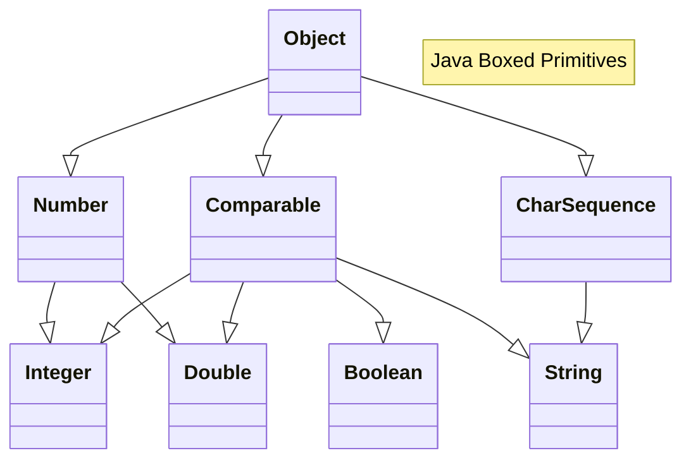
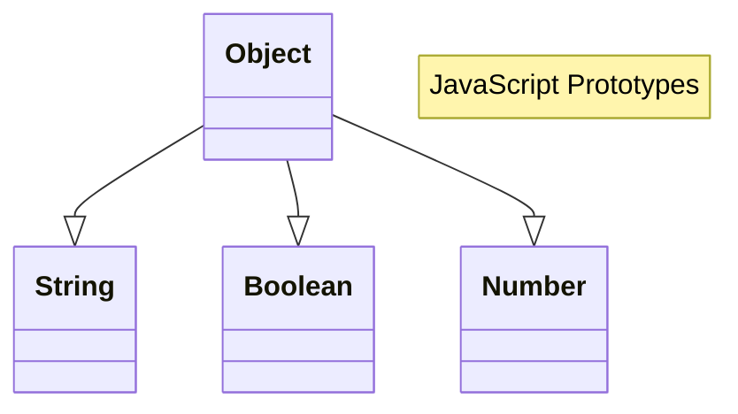
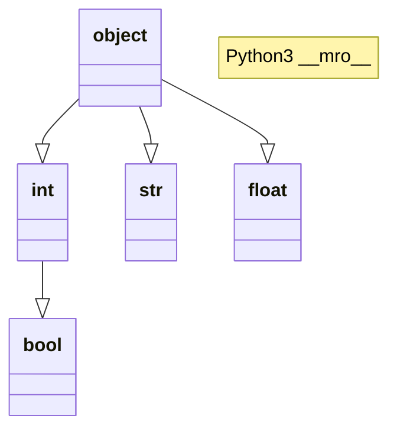
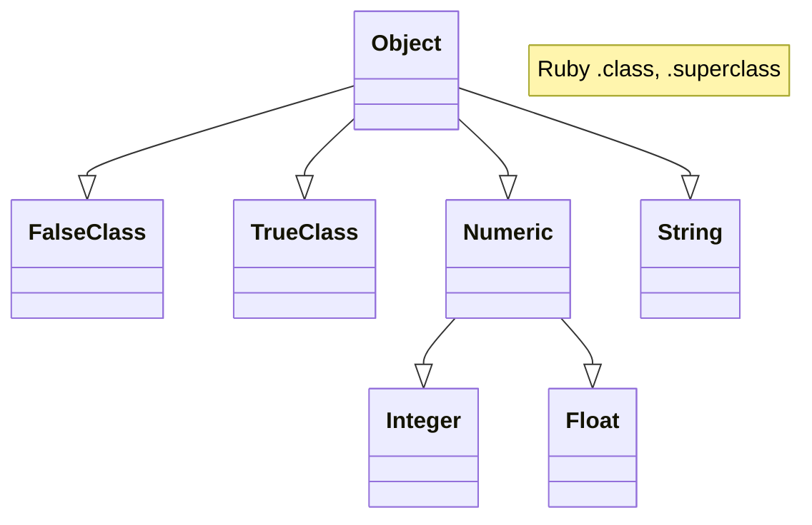

# Generically Speaking

<small>(This is part of a [series of articles](./stretching.md) each of which highlights a difficulty in translating a familiar programming concept across programming languages and highlights design choices to bridge that gap)</small>

Many programmers cut their teeth on sorting algorithms. Indeed, the French word for *computer*, *ordinateur*, comes from a word that means sorter.

Everyone makes mistakes, but if there's one thing programmers get right, it's sorting.

<div class="grid" markdown>

```py
🐚$ python3
Python 3.13.2 (main, Feb  4 2025, …
Type "help", "copyright", "credits"…
>>> array_of_nums = [9, 7, 10, 11, 8]
>>> array_of_nums.sort()
>>> array_of_nums
[7, 8, 9, 10, 11]
```

```js
🐚$ node
Welcome to Node.js v23.11.0.
Type ".help" for more information.
> let arrayOfNums = [9, 7, 10, 11, 8]
undefined
> arrayOfNums.sort()
[ 10, 11, 7, 8, 9 ]
```

</div>

That array! *Quel désarroi?!*

Temper aims to translate well to all the other programming languages. To do that, we need to impose some order on generic operations like&mdash;well&mdash;ordering. The more generic the code, the more important context is. Join us as we look at languages' differing approaches to genericity and find some language design tricks that let us translate generic functions well to many many languages.

<!-- more -->

Which language is the odd duck here? Let's try a few more languages.

<div class="grid" markdown>

```perl
🐚$ perl -de1

Loading DB routines from perl5db.pl version 1.80
Editor support available.

Enter h or 'h h' for help, or 'man perldebug' for more help.

main::(-e:1):	1
  DB<1> @nums = (9, 7, 10, 11, 8);

  DB<2> print(join(", ", (sort @nums)))
10, 11, 7, 8, 9
```

```php
🐚$ php -a
Interactive shell

php > $nums = array(9, 7, 10, 11, 8);
php > sort($nums);
php > print(implode(", ", $nums));
7, 8, 9, 10, 11
```

```ruby
🐚$ irb

WARNING: This version of ruby is …

irb(main):001:0> nums = [9, 7, 10, 11, 8]
=> [9, 7, 10, 11, 8]
irb(main):002:0> nums.sort
=> [7, 8, 9, 10, 11]
irb(main):003:0> [9, 7, "10", 11, 8].sort
Traceback (most recent call last):
        …
        1: from (irb):3:in `sort'
ArgumentError (comparison of Integer with String failed)
```

```lua
🐚$ lua
Lua 5.4.7  Copyright (C) 1994-2024 Lua.org, PUC-Rio
> nums = {9, 7, 10, 11, 8}
> table.sort(nums)
> print(table.concat(nums, ", "))
7, 8, 9, 10, 11
```

</div>

Dynamic languages seem to slightly prefer `[7, 8, 9, 10, 11]` over `[10, 11, 7, 8, 9]`. But is that what's actually going on?

When everything else fails, read the manual. [JavaScript's Array sort](https://developer.mozilla.org/en-US/docs/Web/JavaScript/Reference/Global_Objects/Array/sort) documentation notes:

> If `compareFn` is not supplied, all non-undefined array elements are sorted by converting them to strings and comparing strings in UTF-16 code units order.

Ok. Perhaps we missed an input. Let's try again in JavaScript.

```js
🐚$ node
Welcome to Node.js v23.11.0.
Type ".help" for more information.
> let arrayOfNums = [9, 7, 10, 11, 8];
undefined
> arrayOfNums.sort((a, b) => a - b)
[ 7, 8, 9, 10, 11 ]
> let arrayOfMostlyStrings = ["9", "7", 10, "11", "8"];
undefined
> arrayOfMostlyStrings.sort((a, b) => a - b)
[ '7', '8', '9', 10, '11' ]
```

But how did PHP, which was heavily influenced by Perl know to compare numerically above?[^php.operators.comparison]

[^php.operators.comparison]: [php.net Manual &sect; Comparison Operators](https://www.php.net/manual/en/language.operators.comparison.php)

> If both operands are numeric strings, or one operand is a number and the other one is a numeric string, then the comparison is done numerically. These rules also apply to the switch statement. The type conversion does not take place when the comparison is `===` or `!==` as this involves comparing the type as well as the value.

PHP's default sort flag, *SORT\_REGULAR*, tries to side-step confusion between numeric and string order by defining a different order for *numeric strings* than for *regular strings*. The authors can see the appeal for this design choice in a language that often deals with lists of strings from numeric database columns, but potentially picking a different sort order for different pairs of elements trades one set of bugs for another.

So any sorting code just need to always specify an order. Problem solved.

## Generic Functions

But this article isn't about ordering. It's about **generic functions**. A generic function is one that can work with many types. For example, sorting is generic when the sorting algorithm can be *generalized* to sort lists of numbers, strings, dates, etc. But as shown, context matters; you often need to specialize a generic function with a specific type's conception of, in the case of *sort*, ordering.

As seen below, a language for generic programming has to allow mixing a general framework of *type-agnostic* instructions with a few specialized instructions whose behaviour depends on the *actual* type *T*.

```ts
/** A string form of the given list like "[..., ..., ...]". */
let stringifyList<T>(list: List<T>): String {
  let sb = new StringBuilder();
  sb.append("[");
  var needsComma = false;
  for (let element of list) {
    if (needsComma) { sb.append(", "); }
    sb.append(
      ⚠️ element ⚠️
    );
    needsComma = true;
  }
  sb.append("]");
  return sb.toString();
}
```

All of that code except for the line between the ⚠️s is generic.
Its behaviour does not depend on the type of list element.

But that one line really matters to the semantics of the function.
Here's boolean list formatting code in three widely used languages when
we *don't* take care to specify exactly how the stringification happens.
We get three different strings: `[True, False]`, `[1, ]`, and `[true, false]`.

<div class="grid" markdown>

```py
🐚$ python3
Python 3.13.2 (main, Feb  4 2025, …
Type "help", "copyright", "credits"…
>>> some_bools = [1 + 1 == 2, 1 + 1 != 2]
>>> print("[%s]" % ", ".join([str(x) for x in some_bools]))
[True, False]
```

```sh
🐚$ perl -e '@some_bools = (1 + 1 == 2, 1 + 1 != 2)' \
>        -e 'print("[" . join(", ", @some_bools) . "]\n")'
[1, ]
```

```js
🐚$ node
Welcome to Node.js v23.11.0.
Type ".help" for more information.
> let someBools = [1 + 1 === 2, 1 + 1 !== 2];
undefined
> console.log(`[${someBools.join(", ")}]`)
[true, false]
```

</div>

## Why Generics Matter?

Generics functions are important tools in library authors' tool kits, but there's a more basic reason for paying attention to generics in Temper.

Generic operations, like stringifying a list of booleans above, are bedrocks for well tested code.  They're essential to programmers' testing and debugging flow.

Unit tests often bundle and compare results using **generic** collections.
Developers often write test assertions using strings; they rely on stable, unambiguous string conversion to craft readable, maintainable tests.

```ts
assert(
  "[true, false]" ==
  `${ functionThatReturnsListOfBooleans(...) }`
);
```

Debugging and logging code **converts arbitrary types** to a standard form.
When that conversion is consistent, the developer has to do less cognitive work to understand what's going on and is led down fewer false trails.

```ts
console.log(
  "Got %s",
  myListOfBooleans
);
```

Temper aims to help developers write high-quality, well tested libraries.
Programmers debugging a library translated into many languages should be able to write unit tests and insert debugging statements as they would in every other language they work in.

Without semantically consistent generic operations, developers will suffer a steeper learning curve when testing and debugging Temper code, and the same debugging effort will yield less improvement.

## A Sample Generic Function: Least Value Of

For the rest of this article, let's consider a function that's a bit more complex than list stringifying but is simpler than a full sorting algorithm.

Below is some pseudo code for a function, *leastValueOf*, that takes a list of some type, *T*, and returns the least element.
It also takes a *fallback* value which it returns when the list is empty.
Unless specified otherwise it compares values using *T*'s natural order.

```js
leastValueOf①(elements, fallback, ②):
  if elements is empty:
    return fallback

  // Handled the no-element-0 case above.
  let leastSoFar = elements[0]

  // Loop over the elements afer 0 comparing each once.
  for i in [1, len(elements)):
    let elementᵢ = elements[i]
    if leastSoFar > elementᵢ③:
      leastSoFar = elementᵢ

  // leastSoFar has been compared to every element in elements, so
  // assuming the ordering is transitive, leastSoFar is the least
  // among elements.
  return leastSoFar
```

The circled numbers shows that this pseudocode glosses over some important details:

1. Typed language will often require some kind of type parameter declaration, like `<T>` possibly with type bounds that show that `T`s can be compared to each other.
2. We talked about taking an order as a parameter when natural order is not desired.  What if you want the least string in a case-insensitive comparison?  Different languages support that in different ways.
3. The `>` performs some *type-specific* comparison.

The next few sections will look at common features[^models-of-generics] of programming languages and how they might be used to implement this function and the pros and cons of trying to translate generic functions using those features.

Afterwards, this article details Temper's goals for type genericity, outlines the approach Temper uses and gives examples of how this will translate in languages that are representative of the groups discussed.

[^models-of-generics]: "[Models of Generics and Metaprogramming: Go, Rust, Swift, D and More]"(https://thume.ca/2019/07/14/a-tour-of-metaprogramming-models-for-generics/)


## Runtime type information (RTTI)

In typed languages the compiler has access to type information, but even dynamic languages often have type information.

Runtime type information (RTTI) is available when a language provides operators that distinguish between types of values as the program is running.

<div class="grid" markdown>

```js
🐚$ node
Welcome to Node.js v23.11.0.
Type ".help" for more information.
> typeof "string"
'string'
> typeof 123
'number'
> typeof false
'boolean'
```

```py
🐚$ python3
Python 3.13.2 (main, Feb  4 2025, …
Type "help", "copyright", "credits"…
>>> type('string')
<class 'str'>
>>> type(123)
<class 'int'>
>>> type(False)
<class 'bool'>
>>> isinstance(False, bool)
True
>>> isinstance(False, int)
True
```

</div>

We could implement our generic function in JavaScript/TypeScript as below, using RTTI checks to pick a default comparison function when none is specified.

```ts
export function leastValueOf<T>(
  elements: Array<T>, fallback: T,
  compare: (a: T, b: T) => (-1 | 0 | 1) = pickComparisonFnFor(fallback)
):
  if (!elements.length) {
    return fallback;
  }

  let [leastSoFar, ...rest] = elements;

  for (let element of rest) {
    if (compare(leastSoFar, element) > 0) {
      leastSoFar = element;
    }
  }

  return leastSoFar;
}

function pickComparisonFnFor<T>(x: T): (a: T, b: T) => (-1 | 0 | 1) {
  if (typeof x === 'object' || typeof x === 'function') {
    // A referency type.
    // Try using .compareTo method.
    return (a: T, b: T) => {
      if (a === n) { return 0; }
      if (!a) { return -1; } // Sort null early
      if (!b) { return 1; }
      let delta = +(a?.compareTo(b) ?? 0);
      return !delta ? 0 : Math.sign(delta);
    };
  }
  return ((a, b) =>
    (a === b) ?  0 :
    (a <   b) ? -1 : 1);
}
```

This code is dodgy, but it demonstrates that if you have an instance, in languages with RTTI you can sometimes pick a strategy as the program is running.

How widespread is RTTI? Perl5 has types[^perldata]:

> Perl has three built-in data types: scalars, arrays of scalars, and associative arrays of scalars, known as "hashes". A scalar is a single string (of any size, limited only by the available memory), number, or a reference to something

Oops. Perl has one *scalar* type which is used to represent strings, integers, floating point numbers, and booleans.

[^perldata]: From [Perldoc &sect; perldata](https://perldoc.perl.org/perldata)

Perl and PHP both have added [experimental functions](https://perldoc.perl.org/builtin#created_as_number) like *is_bool* that report approximate runtime type information. When used carefully, they allow libraries to do generic conversion of records to JSON, for example emitting JSON `false` instead of `0` depending on whether the scalar came from a logical operator like `!` or `||`. The Temper designers want to avoid reliance on brittle RTTI because it imposes a recurring tax on library users to write code in an unnatural way.

JavaScript distinguishes between strings and numbers but not between small integers and floating point numbers.

RTTI is not sufficient, even among widely used dynamic languages, to let Temper meet its goal of specializing behaviour based on actual type parameter bindings.

- RTTI is not available when there are no inputs of that type.  How for example, could a function using RTTI determine a type's *distinguished zero value* given an empty list.
- RTTI often conflates related types: Besides Perl 5's scalar, JavaScript's `number` type does not distinguish between integers and floating point numbers.

## Monomorphization

Monomorphization means "one-shaping."  In monomorphizing languages, you can define a generic function, but then the language makes sure that each function call is to a function that only deals with one shape of input.  Typically this is by creating, under the hood, a copy[^rust-mono] of the generic function where type-specific operations are specialized for the actual type.  Rust traits and C++ templates are monomorphized.

```rust
fn leastValueOf<T>(elements: Vec<T>, fallback: T) -> T
where T: Ord + Copy,
{
    if elements.is_empty() {
        return fallback;
    }

    let mut leastSoFar = elements[0];
    for &element in &elements[1..] {
        if element < leastSoFar {
            leastSoFar = element;
        }
    }

    leastSoFar
}
```

The `<` operation in the Rust code is rewritten, by the monomorphizer to be expressed in terms of `<T>`'s *impl*ementation of *Ord.cmp*.  So if you used *leastValueOf* with a concrete struct *MyStruct* it might be calling into a specialized copy as if you had written this:

```rust
fn leastValueOf<MyStruct>(elements: Vec<MyStruct>, fallback: MyStruct) -> MyStruct
{
    if elements.is_empty() {
        return fallback;
    }

    let mut leastSoFar = elements[0];
    for &element in &elements[1..] {
        if MyStruct::cmp(element, leastSoFar) == Ordering::Less {
            leastSoFar = element;
        }
    }

    leastSoFar
}
```

When and how monomorphization happens is highly implementation dependent, but it requires one of these things:

- **whole program analysis**, like Rust, so that the compiler can monomorphize all generic calls ahead of time, or
- **tight integration of the monomorphizer with the runtime**, like Julia, so that as generic calls are loaded or run, they can be monomorphized, or
- **a small, sufficient set of type actuals**, like C#[^csharp-partial-monomorphs], so that the compiler can generate enough monomoprhizations to satisfy calls with any possible actual type parameters.

Whole program analysis lets the language define all needed parameterizations ahead of time.  For example, if the only calls to *leastValueOf* are *leastValueOf&lt;String&gt;(&hellip;)* and *leastValueOf&lt;Int&gt;(&hellip;)* then the compiler can generate those two variants and link the calls to them.

Unfortunately, Temper is a language for libraries, not whole programs. Temper never has access to the whole program.  The Temper compiler can't generate monomorphized variants of generic functions for code written in other languages which use libraries translated from Temper as it never sees them. Also, this variety of monomorphization tends to increase code size which is terrible for languages like JavaScript which ship source code to the browser.

Tight runtime integration involves running the monomorphizer when a previously uncompiled parameterization is found. The Julia language takes a just-in-time compiler[^julia-ORCv2] approach to monomorphization[^julia-code-caching].

Unfortunately, Temper is a language that needs to produce translations that load into any runtime.  Temper has no control over the runtime, because it has no runtime.  We can't expect other languages' runtimes to support dynamic code loading much less embed the Temper compiler. Even if we could, doing so would conflict with our goal to support runtimes that use [non-executable stacks](https://en.wikipedia.org/wiki/Executable-space_protection) as a protective measure against buffer overflows.

C# generates monomorphizations for value types and then one extra monomorphization for all reference types. This lets it use a *bool\[\]* array under the hood for its *ArrayList&lt;bool&gt;*, but for all reference types like *ArrayList&lt;MyClass&gt;* it uses a pointer array.  C# does not need to [box](https://learn.microsoft.com/en-us/dotnet/csharp/programming-guide/types/boxing-and-unboxing) every primitive value stored in a generic collection.

Unfortunately, C# style monomorphization won't work for Temper.  Temper needs to be able to connect multiple types to the same underlying type, for example a third party Temper library might have a *Date* and *DateTime* type that both connect to some language's *Timestamp* type but the stringification and equality of the two still needs to preserve that distinction.  There is no exhaustive set of monomorphizations that would preserve Temper semantics given third-party, ambiguous connections.

There are definite use cases for monomorphization, and Temper may one day support explicit, coarse-grained, ahead-of-time monomorphization based on a mechanism like OCaml's parameterized modules. But it is the wrong tool for translating generic function definitions to other programming languages.

[^csharp-partial-monomorphs]: [](https://blog.stephencleary.com/2022/10/modern-csharp-techniques-3-generic-code-generation.html#generics-and-value-types) notes "C# generics do *not* undergo monomorphization for reference types; there’s only one copy of the type/method implementation that is shared between all reference types. However, C# generics *do* undergo monomorphization for value types!"

[^rust-mono]: [Rust Compiler Development Guide &sect; Monomorphization](https://rustc-dev-guide.rust-lang.org/backend/monomorph.html) explains monomorphization thus: compiler stamps out a different copy of the code of a generic function for each concrete type needed.

[^julia-ORCv2]: The [Julia JIT](https://docs.julialang.org/en/v1/devdocs/jit/) allows pausing function calls to specialize a function, invoke the compiler, and load code before resuming.

[^julia-code-caching]: "[Julia's latency: Past, present and future](https://viralinstruction.com/posts/latency/index.html#a_brief_primer_of_julia_code_caching)" talks about monomorphization as a way to balance performance with Julia's design goals: interactive use by a programmer prevents whole program analysis but for performance they need devirtualization.

## Virtual Method Calls

In Java, our *leastValueOf* function could delegate the generic operation to an abstract method.

```java
public static <T>
T leastValueOf(
  Iterable<T> elements,
  T fallback,
  Comparator<T> comparator
) {
  Iterator<T> it = elements.iterator();
  if (!it.hasNext()) {
    return fallback;
  }

  T leastSoFar = it.next();
  while (it.hasNext()) {
    T candidate = it.next();
    if (/*⚠️*/comparator.compare(leastSoFar, candidate) > 0/*⚠️*/) {
      leastSoFar = candidate;
    }
  }

  return leastSoFar;
}

public static <T extends Comparable<? super T>>
T leastValueOf(
  Iterable<T> elements,
  T fallback
) {
  return leastValueOf(elements, fallback, Comparator.<T>naturalOrder());
}
```

Java provides a *Comparable* type and a *Comparator*.  The first method uses a *Comparator* to express how to compare two values of a specific type.  The second method, an overload of the first, defaults to the natural order when *&lt;T&gt;* is a type that knows how to compare `this` to another value of the same type or a supertype.

When the *comparator.compare* is called, the actual method implementation might need to be looked up in a virtual method table (vtable).
Unlike monomorphization, this isn't done once by rewriting code.  It might happen every time the method is called.

Java has an abstract super-type, *java.lang.Object*, for all reference types which defines some generic operations:

- *.equals(Object)* and *.hashCode()* which define equivalence relations
- *.toString()* which defines a natural or debugging string form

Unfortunately, Temper needs to be careful about super-types.  Can we rely on types having equivalent super-types?  Let's look at some languages' type hierarchies just for numeric, string, and boolean types.

<div class="grid" markdown>









</div>

Even among these few languages, there is a wide divergence in the type hierarchy.

- JavaScript has no dedicated float type
- In Python, *bool* is a subtype of *int*
- Ruby doesn't have just one boolean class, it has two, and neither is comparable via `<` to the other.

Some languages, C++ for example, have no type hierarchy for these types.

Temper cannot assume that there is an abstract type that provides a method for *comparison* or *equivalence* or some other generic operation.

## Boxing

A value can be thought of as:

- a type and
- some pointers and/or
- some non-pointer bits

Compilers and runtimes often carefully arrange program operations so that they can erase the type part.

Boxing is the act of combining a value representation that doesn't carry type info with type info.  It's often done in languages that have a distinction between classes and primitives; by providing classes corresponding to primitives, e.g. *java.lang.Integer* for *int*, you can use primitives where only class instances are allowed.

Boxed types and unboxed types can have divergent behavior though because sometimes operators are overloaded differently for boxed and unboxed values.  For example, in Java, `==` checks value-equality for *int*s but means reference-equality for the corresponding box type.

Normally, you'd use `.equals` to check equality for references, but Java again has different semantics: `.equals` for (capital-D) *Double* obeys an equivalence relationship[^java-Double-compareTo-caveat], but `==` for (lowercase-d) *double* performs IEEE-754 comparison which treats signed zeroes as equivalent.

[^java-Double-compareTo-caveat]: Java's comparison operators perform NaN poisoning comparison, but the [*Double.compareTo*](https://docs.oracle.com/javase/8/docs/api/java/lang/Double.html#compareTo-java.lang.Double-) method implements a valid ordering predicate.  See "There are two ways in which comparisons performed by this method differ from those performed by the Java language numerical comparison operators &hellip;"

<div class="grid" markdown>

```java
🐚$ jshell
|  Welcome to JShell -- Version 21.0.4
|  For an introduction type: /help intro

jshell> int i = Integer.MAX_VALUE, j = Integer.MAX_VALUE;
i ==> 2147483647
j ==> 2147483647

jshell> Integer I = i, J = j;
I ==> 2147483647
J ==> 2147483647

jshell> i == j
$5 ==> true

jshell> I == J
$6 ==> false
```

```java
🐚$ jshell
|  Welcome to JShell -- Version 21.0.4
|  For an introduction type: /help intro

jshell> double n = -0.0, p = 0.0;
n ==> -0.0
p ==> 0.0

jshell> Double N = n, P = p;
N ==> -0.0
P ==> 0.0

jshell> n == p
$5 ==> true

jshell> N.equals(P)
$6 ==> false
```

</div>

If Temper's Java translation exposed boxed numbers to Java code calling into Temper libraries, then idioms like the above would trip up programmers: boxes are not idiomatic.

Temper could use boxes to create important distinctions: Temper could create a JavaScript *Integer* box to work around JavaScript's lack of a float/int distinction.  Again, such an approach, unless hidden from hand-written JavaScript, would run into the same overload problem.  And there's no way to have boxes when you need them and hide them from code; as soon as a box needs to be stored in a struct property or added to a list, it's potentially exposed to hand-written code.  If Temper boxed part of the world it would have to box the whole world.

```js
🐚$ node
Welcome to Node.js v23.11.0.
Type ".help" for more information.
> let i = 0, j = 0;
undefined
> let I = new Number(i), J = new Number(j);
undefined
> i == j
true
> I == J
false
```

Boxes are often heap allocated instead of stack allocated, so they come with performance penalties. Boxing and unboxing has a prehibitive performance penalty in tight numeric processing loops.

Boxing can solve very specific language design problems when considered carefully in the context of one language, but cannot be foisted onto languages as part of a broadly effective translation strategy.

## Goals

We alluded to requirements above when discussing approaches to generics that have worked for other languages. But to clarify the motivation:

Temper needs **consistent behaviour for collections types**.  Inconsistent behaviour, especially in test code, would provide a significant barrier to writing well-tested, reliable libraries in Temper.

Temper needs **libraries of common algorithms**. Specialist library authors should be able to write generic functions that many generalists can use to support their own efforts. Not every Temper user will need to write generic functions, but most will need to use them.

Parts of generic functions need to **specialize behavior** based on type bindings.  *leastElementOf&lt;String&gt;* should internally be able to compare based on string order, differently from *leastElementOf&lt;Int&gt;*. Ideally the generalist would not have to specify *String* vs *Int* comparison; type inference should handle that in the common case.

Temper needs the **flexibility to connect** multiple Temper types to the same target language type. When translating to a language that does not often distinguish between strings and numbers, Temper code should not conflate string operations and numeric operations.

Temper needs to **provide generic libraries to other languages**. A Java developer, for example, using the Java translation of a Temper library should be able to call a generic Temper function with a Java type that Temper has never heard of.

Temper needs to impose **a low-burden on translator writers**.  A Java language expert should be able to write and maintain a translator from Temper's intermediate representation to Java code without having to simoultaneously thread multiple type-hierarchy-constraint needles.

## Implementing leastValueOf in Temper

For Temper, we're taking a different approach than the ones above, but
not one that is entirely without precedent: *reifying type-associated behaviours*[^ceylon-reifies].

[^ceylon-reifies]: [The Ceylon Language &sect; 1.2 Type system](https://web.mit.edu/ceylon_v1.3.3/ceylon-1.3.3/doc/en/spec/html_single/#thetypesystem) notes "Ceylon's type system is fully reified. In particular, generic type arguments are reified"

It can be translated to any language for which we can translate regular classes and interfaces.

(Some readers may be surprised that we consider classes and interfaces a low bar for translation.  This would seem to conflict with translation to important [single-inheritance](https://en.wikipedia.org/wiki/Multiple_inheritance#Single_inheritance) languages like JavaScript and Ruby. It turns out that widely used single-inheritance languages also turn out to support tricks [^Symbol.hasInstance] enabling as-if multiple-inheritance)

[^Symbol.hasInstance]: JavaScript allows [specializing `instanceof`](https://developer.mozilla.org/en-US/docs/Web/JavaScript/Reference/Global_Objects/Symbol/hasInstance) so though it is hard to do multiple inheritance in user code, it is not difficult to provide ergonomic multiple inheritance from generated code.

[^rb-is-a-override]: Ruby allows [overriding the *is\_a\?* message](https://stackoverflow.com/q/4894613/20394).

```temper
/**
 * The least value in *list* or *fallback* if *list* is empty.
 * All comparisons are according to *cmp*.
 */
let leastElementOf<T supports Comparison<T>>(
  elements: List<T>,
  fallback: T,
  cmp supports T,
): T {
  let n = list.length;
  if (n == 0) { return fallback }

  var minSoFar = list[0];

  for (var i = 1; i < n; ++i) {
    let element = list[i];
    if (cmp.compare(minSoFar, element) > 0) {
      minSoFar = candidate;
    }
  }

  minSoFar
}

// We should be able to apply leastElementOf to lists of
// strings or numbers and in both cases, get the least according to
// the "natural" order.
test("leastElementOf") {
  assert(leastElementOf<String>(["c", "a", "b"], "") == "a");
  assert(leastElementOf<Int   >([  3,   1,   2],  0) ==   1);
}

```

This is code in Temper that doesn't currently work. We're implementing parts of this scheme as I write this.  Note though that:

- `leastElementOf` is a generic function; it declares a type parameter `<T>` using a syntax familiar to C++, C#, Rust, and TypeScript developers
- That type parameter has an upper type bound, `Comparison<T>`, declared with an unfamiliar keyword: `supports`
- The function takes three inputs and the last one, `cmp` doesn't have a type but it says it *supports* the type parameter `T`.
- That input, `cmp`, is used to compare values of type `T` obtained from the list by calling `cmp.compare`.
- In the unit test at the bottom, no value is explicitly passed for `cmp`.

Let's look at how this is going to fit into Temper's pre-translation compilation pipeline.

First, Temper defines some builtins.  *Comparison* just explains how to compare two values of a particular type.  It's the upper bound for *leastValueOf*'s type parameter.  It's also the type of the *cmp* input.

```temper
export interface Comparison<T> {
  compare(a: T, b: T): Int;
}
```

Some of our basic types need to support comparison.  That involves a clause `supports Comparison<...>` that can occur alongside any `extends ...` clause but which does not imply a subtype relationship.

The `supports` clause says that, for each abstract method in the supported interface, the type must have a compatible static method.

We add code to the types that need to support comparison.

```diff
 export class String
+supports Comparison<String>
 {
+  public static compare(a: String, b: String): Int { ... }

   ...
 }

 export class Int
+supports Comparison<Int>
 {
+  public static compare(a: Int, b: Int): Int { ... }

   ...
 }
```

The Temper compiler will then generate subtypes of *Comparison* based on *supports* clauses.

```diff
+// Generated code
+
+class StringSupport extends Comparison<String> {
+  public compare(a: String, b: String): Int {
+    String.compare(a, b)
+  }
+}

 export class String
 supports Comparison<String> {
+  @supportFactory(Comparison<String>)
+  public static support(): Comparison<String> { new StringSupport() }
 }
```

Moving the support for comparison onto a *StringSupport* class lets us avoid assuming anything about string type's vtables, and lets us avoid assuming that strings have methods.  This works around the problems with virtual methods above.

Finally, what about calls to the generic methods:

```diff
 test("leastElementOf") {
-  assert(leastElementOf<String>(["c", "a", "b"], "") == "a");
+  assert(leastElementOf<String>(["c", "a", "b"], "", String.support()) == "a");
-  assert(leastElementOf<Int   >([  3,   1,   2],  0) ==   1);
+  assert(leastElementOf<Int   >([  3,   1,   2],  0, Int.support())    ==   1);
 }
```

Inside Temper, we can add additional arguments to calls.  If a call to a generic method appears inside another method that *supports* a type parameter, we can auto-wire that through.  If it is called outside a generic context, we can use the actual type binding to derive an actual argument.

Outside Temper, backends may generate default expressions for formal arguments with *supports* clauses or use overloading to achieve the same.

This generics scheme has a few unintended, nice properties:

- One can pass a different *Comparison* into *leastElementOf*.  For example, you can define a generic *reverseComparison* function that wraps a *Comparison* and negates its result, and pass that in.
- A Temper backend author can connect the *interface Comparison*.  For example, the Temper *Comparison&lt;T&gt;* could connect directly to *java.util.Comparator&lt;T&gt;* in the Java backend separately from any of the types that support comparison.

## Summary and Conclusions

Generic functions embed type-dependent operations within a type-agnostic algorithmic framework.  The need to connect those dependent bits makes them a source of significant complexity in language design.

Temper has additional needs for genericity: consistent equality and stringification of collections is essential to developer workflow and the only path to semantic consistency goes through generics.

Temper is also a language that needs to work on many diverse runtimes over which it has no control. This makes many approaches to genericity unavailable to Temper.

Nevertheless, there is a light-weight reification approach that splits the difference: by embodying generic behaviour in auto-generated support classes, Temper avoids entangling the concrete Temper types that need to flexibly connect to pre-existing types in the languages to which Temper translates.  If a generic algorithm wants to require methods, it can declare a type parameter *extends* an upper bound, but if not, it can declare *supports* and get just enough reification.

This meets Temper's goals of placing a low burden on target language experts who write translators, but still supporting Temper library authors in writing well tested, reliable libraries with consistent semantics.
