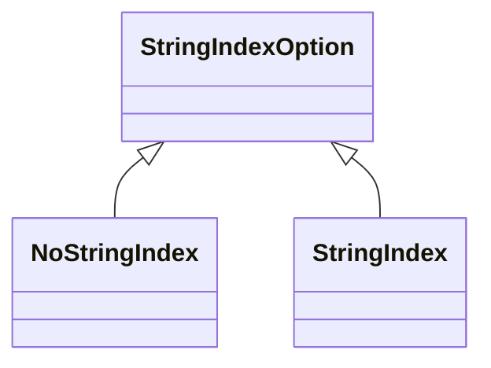

# A Tangle of Strings

![Picture of an Adam West Batman villain next to text: RANDOM ACCESS A villain for our time.  On a matte light blue background with shadow behind him, a clean shaven crew cut man wears a light green jumpsuit with a curliecue question mark on the chest in dark green.  He has a mask that covers only his eyes, but the mask is not on his eyes; it hangs loosely around his neck.  His eyes bulge as he looks straight at you while shifting his jaw to one side halfway between a grimace and a leer.  He wears white gloves on his hands and looks to be in the process of splaying his fingers to make the glove fit while holding the end of that same glove in place with his other hand.](../images/RandomAccess.png){ .masthead }

<small>(This is part of a [series of articles](./stretching.md) each of which highlights a difficulty in translating a familiar programming concept across programming languages and highlights design choices to bridge that gap)</small>

I don't need to explain strings to you, dear reader.  **Strings** are a major tool in every programmer's toolbox.  Some say it's the [only one you need](https://blog.codinghorror.com/new-programming-jargon/#7-stringly-typed).  Everyone knows how they work; there's no way programming languages could disagree on what basic string operations mean?

Right! Right?

<div class="grid" markdown>

```js
🐚$ node
Welcome to Node.js v23.11.0.
Type ".help" for more information.
>   String.fromCodePoint(0x0FFFF) <
... String.fromCodePoint(0x16F00)
false
>
```

```py
🐚$ python3
Python 3.13.2 (main, Feb  4 2025, …
Type "help", "copyright", "credits"…
>>> chr(0x0FFFF) < \
... chr(0x16F00)
True
>>>
```

</div>

How could Python and JavaScript come up with different answers to this basic string question?!?

<!-- more -->

Since the Temper language is designed to translate faithfully to all
the other languages, our *String* type needs consistent semantics
across languages.  Otherwise, a programmer reaching for their trusty
tool would have to know of and test for many languages' quirks.  We'd
fail in one of our design goals: in Temper, a little testing effort
goes a long way.

!!! note ""

    How can we craft a *String* API that is both **familiar to developers** and has a **consistent, useful semantics**?

Let's dive into strings.  First, what are existing languages' quirks?
Second, how can we thread those needles to provide consistent semantics.

## A refresher on string encoding

This is not a Unicode primer.  If you're unfamiliar with terms like *codepoints* and *string encoding*s, there're better sources of information.

- "[The Absolute Minimum Every Software Developer Absolutely, Positively Must Know About Unicode and Character Sets \(No Excuses!\)](https://www.joelonsoftware.com/2003/10/08/the-absolute-minimum-every-software-developer-absolutely-positively-must-know-about-unicode-and-character-sets-no-excuses/)" introduces Unicode and character sets.
- "[Fifty years of strings: Language design and the string datatype](https://ztoz.blog/posts/strings-history/)" details the co-evolution of string types and character encoding.
- [Unicode.org's Tutorial Page](https://www.unicode.org/standard/tutorial-info.html) has officially endorsed training presentations and gets into some of the linguistics & anthropology behind why Unicode is the way it is.

Those code samples above construct strings from integer codepoint values.
The JavaScript `String.fromCodePoint(0x0FFFF)` constructs a string with a single codepoint, *U+FFFF*.  And the Python `chr(0x16F00)` constructs a string with one codepoint, *U+16F00*.

An encoding is a way of converting codepoints (technically code units) into bytes that can be laid out in memory.  The way bytes are actually laid out by running programs is complicated (e.g. [SSO](https://tc-imba.github.io/posts/cpp-sso/), [content-aware optimizations](https://medium.com/@brijesh.sriv.misc/optimizing-string-memory-usage-in-java-11-4c34f4a1a08a#what-are-compact-strings)), but the table below shows how that second string in detail, \[U+16F00\], can be laid out by three languages that are emblematic of the three most widely used encodings.  U+16F00 is a [supplementary code point](https://www.unicode.org/glossary/#supplementary_code_point) so it's representation varies wildly across encodings.

<span id="table-utfs" name="table-utfs"></span>

<table border="1" cellpadding="2" cellspacing="0"><tr><th>Language</th><th>Character Kind</th><th colspan="4">Characters in U+16F00</th><th>Length</th></tr>
<tr><td>Python3</td><td>UTF-32 code unit</td><td colspan="4">16F00<sub>16</sub></td><td>1</td></tr>
<tr><td>JavaScript</td><td>UTF-16 code unit</td><td colspan="2">D81B<sub>16</sub></td><td colspan="2">DF00<sub>16</sub></td><td>2</td></tr>
<tr><td>Lua</td><td>Octets, probably UTF-8</td><td>F0<sub>16</sub></td><td>96<sub>16</sub></td><td>BC<sub>16</sub></td><td>80<sub>16</sub></td><td>4</td></tr>
</table>

## A cast of characters

Lots of string corner cases deal with supplementary codepoints.
Let's introduce some characters that will reoccur in code examples below.

Miao is a human language in the Hmong language family mostly spoken in
and around Vietnam.  It's often written using
[Pollard Script](https://en.wikipedia.org/wiki/Pollard_script)
which appears in Unicode in supplementary code pages ([U+16Fxx](https://www.unicode.org/charts/PDF/U16F00.pdf)).
Many of its characters appear superficially similar to the Latin
characters used by English writers because it was inspired by Cree.

- '&#x16F00;' (U+16F00) Miao Letter Pa (seen above)
- '&#x16F20;' (U+16F20) Miao Letter Yi Ka

In addition to those characters, expect to see:

- 'L' (U+4C) ASCII Letter L
- '&#x393;' (U+393) Greek Capital Letter Gamma

So when you see a character like a backwards 'L', think Miao supplementary codepoints, and when you see the Gamma which looks like an upside-down 'L', think basic code plane but not ASCII.

And here are those characters in the three major Unicode encoding schemes.

<span id="cast-of-chars-encoded"></span>

<table border="1" cellpadding="2" cellspacing="0"><tr><th>Codepoint</th><th colspan="4">UTF-8</th><th colspan="2">UTF-16</th><th>UTF-32</th></tr>
<tr><th>'L' U+4C</th><td><tt></tt></td><td><tt></tt></td><td><tt></tt></td><td><tt>4C</tt></td><td><tt></tt></td><td><tt>00 4C</tt></td><td><tt>00 00 00 4C</tt></td></tr>
<tr><th>'&#x393;' U+393</th><td><tt></tt></td><td><tt></tt></td><td><tt>CE</tt></td><td><tt>93</tt></td><td><tt></tt></td><td><tt>03 93</tt></td><td><tt>00 00 03 93</tt></td></tr>
<tr><th>'&#x16F00;' U+16F00</th><td><tt>F0</tt></td><td><tt>96</tt></td><td><tt>BC</tt></td><td><tt>80</tt></td><td><tt>D8 1B</tt></td><td><tt>DF 00</tt></td><td><tt>00 01 6F 00</tt></td></tr>
<tr><th>'&#x16F20;' U+16F20</th><td><tt>F0</tt></td><td><tt>96</tt></td><td><tt>BC</tt></td><td><tt>a0</tt></td><td><tt>D8 1B</tt></td><td><tt>DF 20</tt></td><td><tt>00 01 6F 20</tt></td></tr>
</table>

## Where strings unravel

Let's look at how strings are represented, as values in memory, and presented to developers writing code in various programming languages.

We're going to look informally at a number of aspects and invariants, discussing each one in the context of a handful of languages.  Then we'll summarize in a table for far more languages.

- *Ordering*: what does the language's primary comparison operator (`<`) mean applied to strings?
  These turn out to group into UTF-16 order and codepoint order.
- *Counting*: how does the language count characters?
  This turns out to group by common Unicode encoding: UTF-{8,16,32}.
- *Indexing and Iteration*: how does the language allow dealing with parts of a string? If the language provides both integer loops `for (int i = 0; i < ...; ++i)` and *for each* style loops, does using them to iterate over strings result in the same kinds of code units?
  Often, the latter is by codepoint even if the former is not.
- *Concatenation*: How does the language combine parts of strings into wholes?  Do different code unit representations (especially UTF-16 surrogates) persist after concatenation?  Is the length of a concatenation the sum of the lengths of the parts?
  There is quite a lot of variety here.

(We, the Temper contributors, love all programming languages equally but we've biased towards widely used programming languages with good interactive command line tools so that the examples are easy to understand and reproduce.)

### Ordering

Why did JavaScript and Python3 differ when comparing two strings in our first example above?  JavaScript's *String.fromCodePoint\(0xFFFF\)* and Python's *chr\(0xFFFF\)* should mean the same thing.

Python's library specification[^1] defines string comparison:

> Sequences of the same type also support comparisons. In particular, tuples and lists are compared lexicographically by comparing corresponding elements.

In Python, a string is a sequence of characters.  *Lexicographic* is the key word here.

[^1]: [The Python Standard Library &sect;3.13.2](https://docs.python.org/3/library/stdtypes.html#common-sequence-operations): Common Sequence Operations

The JavaScript specification[^2] says:

> NOTE 2: The comparison of Strings uses a **simple lexicographic ordering** on sequences of UTF-16 code unit values.

[^2]: [Ecma262/2023 &sect;7.2.13](https://tc39.es/ecma262/2023/multipage/abstract-operations.html#sec-islessthan) *IsLessThan*

Wait, JavaScript is not just *lexicographic* but simple too! Even Java is on the lexicographic bandwagon:

> `public int compareTo(String anotherString)` Compares two strings lexicographically.

Programming language designers agree!! Everybody uses **lexicographic comparison** for strings.  Everybody uses **a** lexicographic comparison.  Simple.

> To avoid problems with different data representations, use the CHAR(EBCDIC) compiler option.

Shush, COBOL.

*Lexicographic ordering* simply means compare character by character.  The first pair of characters that differs determines the order.  If none differ, the shorter string is lesser.  As the Python reference noted above, lexicographic order can be generalized to any pair of sequences by comparing elements instead of characers.

Why does JavaScript differ from Python3? JavaScript defines "character" as "UTF-16 code unit values", but Python3 treats strings as sequences of Unicode codepoints.  Other languages like Rust treat them as sequences of [Unicode scalar value]s which are subtly different.  (Python2 does one of those depending on the compiler flag that controls *sizeof(wchar)* used to compile the runtime!)

[Unicode scalar value]: https://www.unicode.org/glossary/#unicode_scalar_value

#### Human language ordering is not lexicographic

Fun fact, language designers do not agree.
In Lua&ge;5, the `<` operator performs *locale-sensitive* comparison.
Unicode defines *collation rules* which capture the dictionary sorting rules for human languages.

[UTR-10](https://www.unicode.org/reports/tr10/#Example_Differences_Table) has this example showing that a German reader would expect 'o'-umlaut next to 'o' in a sorted list but a Swedish reader would not.

> Table 1. Example Differences
>
> | Language |       |
> | -------- | ----- |
> | Swedish  | z < ö |
> | German   | ö < z |

You can see this in Lua:

```lua
🐚$ lua
Lua 5.4.7  Copyright (C) 1994-2024 Lua.org, PUC-Rio
> os.setlocale('sv_SE')
sv_SE
> 'z' < 'ö'
true
> os.setlocale('de_DE')
de_DE
> 'z' < 'ö'
false
```

Languages used for server software usually expose these rules via libraries like Java's [*java.text.Collator*](https://docs.oracle.com/javase/8/docs/api/java/text/Collator.html) so that a program can explicitly deal with human-language text in strings using the right locale for the particular end user which may come from an HTTP header or a user preferences database, not the current process's locale environment variables.

Lua is heavily used to script game actions.  Maybe in a game client, the current locale is a good indicator of the user's preference so this design choice may assist game devs in presenting an inventory list in a way that respects players' preferences.

### Length

How long is our supplementary character, `'𖼀'`?

<div class="grid" markdown>

```js
🐚$ node
Welcome to Node.js v23.11.0.
Type ".help" for more information.
> let s = '𖼀'
undefined
> s.length
2
```

```py
🐚$ python3
Python 3.13.2 (main, Feb  4 2025, …
Type "help", "copyright", "credits"…
>>> s = '𖼀'
>>> len(s)
1
```

```lua
🐚$ lua
Lua 5.4.7  Copyright (C) 1994-2024…
> s = utf8.char(0x16F00)
> #s
4
```

</div>

Ugh, as shown in the [table above](#table-utfs), in Python it's 1 long, in JavaScript 2, and in Lua, it's 4.
The only thing programming language designers actually agree on is powers of two.

### Indexing and iteration

Indexing is about getting a particular character out of a string: *myString\[index\]*.  Iteration is about sequentially operating on characters in a string.

The first loop in the Go program below uses indexing to do iteration.  There's a second loop there.  Go and Rust both have *for each* style loops that operate on UTF-8 encoded bytes to iterate codepoints.

<div class="grid" markdown">

```go
package main
import "fmt"
func main() {
	s := "LΓ𖼀𖼠"
	fmt.Printf("Loop over all byte offsets\n")
	for i := 0; i < len(s); i++ {
		fmt.Printf("  got byte %x at byte position %d\n", s[i], i)
	}
	fmt.Printf("Iterating over chars\n")
	for i, char := range s {
		fmt.Printf("  got char U+%x at byte position %d\n", char, i)
	}
}
```

```
Loop over all byte offsets
  got byte 4c at byte position 0
  got byte ce at byte position 1
  got byte 93 at byte position 2
  got byte f0 at byte position 3
  got byte 96 at byte position 4
  got byte bc at byte position 5
  got byte 80 at byte position 6
  got byte f0 at byte position 7
  got byte 96 at byte position 8
  got byte bc at byte position 9
  got byte a0 at byte position 10
Iterating over chars
  got char U+4c at byte position 0
  got char U+393 at byte position 1
  got char U+16f00 at byte position 3
  got char U+16f20 at byte position 7
```

</div>

What's an easy way to see how indexing relates to codepoints?

Let's ask different languages if the first character of one string is in another. We'll use our two Miao strings: U+16F00 and U+16F20.

<div class="grid" markdown>

```py
$ python3
Python 3.13.2 (main, Feb  …
Type "help", "copyright", …
>>> a = '𖼀'
>>> b = '𖼠'
>>> a[0] in a
True
>>> a[0] in b
False
```

```js
🐚$ node
Welcome to Node.js v23.11.0.
Type ".help" for more information.
> let a = '𖼀';
undefined
> let b = '𖼠';
undefined
> a.includes(a[0])
true
> b.includes(a[0])
true
```

</div>

In that example, *a* and *b* are different, single codepoint strings.
In JavaScript, *a* and *b* have a non-empty prefix in common, but in Python3, they don't.
Again, the root cause is differing definitions of "character" used when indexing.

And this difference bleeds through to lexically identical regular expressions.

<div class="grid" markdown>

```py
Python 3.13.2 (main, Feb  …
Type "help", "copyright", …
>>> a = '𖼀'
>>> import re
>>> re.compile(r'.').match(a)
<re.Match object; span=(0, 1), match='𖼀'>
```

```js
🐚$ node
Welcome to Node.js v23.11.0.
Type ".help" for more information.
> a = '𖼀'
'𖼀'
> /./.exec(a)[0]
'\ud81b'
```

</div>

JavaScript only matches the first of two UTF-16 surrogates without the `u` regular expression flag.

Like Go and Rust, JavaScript and Python both have loops that produce codepoints for strings.  But index loops produce different results.

<div class="grid" markdown>

```js
🐚$ node
Welcome to Node.js v23.11.0.
Type ".help" for more information.
> s = 'LΓ𖼀𖼠'
'LΓ𖼀𖼠'
> for (let c of s) {
...  console.log(c.codePointAt(0).toString(16)) }
4c
393
16f00
16f20
undefined
> for (let i = 0, n = s.length; i < n; ++i) {
...  console.log(s[i].codePointAt(0).toString(16)) }
4c
393
d81b
df00
d81b
df20
undefined
```

```py
🐚$ python3
Python 3.13.2 (main, Feb  …
Type "help", "copyright", …
>>> s = 'LΓ𖼀𖼠'
>>> for c in s:
...     print('%x' % ord(c))
...
4c
393
16f00
16f20
>>> for i in range(0, len(s)):
...     print('%x' % ord(s[i]))
...
4c
393
16f00
16f20
```

</div>

Note that iterating over strings in Python3 produces shorter strings, not numeric values, so we have to apply the `ord` builtin to get a numeric value.
Sometimes they're not shorter.  If you have a Python3 sequence of unknown type, you can't naively recurse into it because every single codepoint string is its own first element.

Swift too: [Swift "characters"](https://docs.swift.org/swift-book/documentation/the-swift-programming-language/stringsandcharacters/#Extended-Grapheme-Clusters) are Grapheme clusters.  This is a lovely, principled approach which means that the naive approach to *isPalindrome* in Swift works for complex Emojis like the [polar bear emoji (🐻‍❄️)](https://riedel.wtf/polar-bear-emoji/).

But most languages that have a *for each* style loop produce codepoints.  Partly this is because these loop constructs were late additions: after surrogates were added to UTF-8. For example, Go `range` loops iterate codepoints even though strings are just byte arrays under the hood.

### Concatenation

The reversal of indexing is concatenation: combining pieces into a string.

Naively, it seems like the length of the concatenation of two strings should be the sum of their lengths.

> `(a + b).length == a.length + b.length`

That's often not true when you're counting codepoints.

In JavaScript, concatenating surrogates (UTF-16 code units used to
make a supplementary codepoint) merges them into one codepoint.

But the concatenation identity holds when you're counting UTF-16.

```js
🐚$ node
Welcome to Node.js v23.11.0.
Type ".help" for more information.
> // Two surrogates
undefined
> a = '\uD81B'
'\ud81b'
> b = '\uDF00' // Another
'\udf00'
> a + b // Surrogate pair
'𖼀'
> // ... splits codepoints
undefined
> [...(a + b + a + b)]
[ '𖼀', '𖼀' ]
> [...a].length
1
> [...b].length
1
> [...(a + b)].length // Combined
1
> a.length + b.length
2
> (a + b).length
2
```

With Python3, that turns out to be true, but concatenating two surrogates does not give you a string equivalent to those two surrogates.

```py
🐚$ python3
Python 3.13.2 (main, Feb  …
Type "help", "copyright", …
>>> a = '\uD81B'
>>> b = '\uDF00'
>>> # Surrogates do not combine
>>> a + b
'\ud800\udc00'
>>> # going to decode some JSON
>>> from json import loads
>>> # JSON parsing combines surrogates
>>> ab_from_json = loads(r' "\uD81B\uDF00" ')
'𖼀'
>>> # These are not the same string
>>> loads(ab_from_json) == (a + b)
False
>>> len([x for x in a])
1
>>> len([x for x in b])
1
>>> len([x for x in (a + b)])
2
>>> len(a) + len(b) == len(a + b)
True
>>> len(ab_from_json) == len(a + b)
False
```

In Python3, there are two distinct strings:

1. The string containing the surrogates (U+D81B, U+DF00) which decode to U+16F00 per UTF-16 semantics.
2. The string containing U+16F00

Most languages do not have that distinction.

1. UTF-16 centric languages like Java, JavaScript, and C# do not because they do not track whether a surrogate was part of a pair or not.
2. Rust because its strings are not codepoints for [security reasons](https://capec.mitre.org/data/definitions/80.html).  They are minimal UTF-8 encoded [Unicode scalar value]s by construction.

Python3 succeeds with the concatenation invariant above, but at the cost of allowing constructing strings that are not constructible in most other languages which raises its own interop concerns.

For example, encoding a string to JSON and decoding it may not give you the same string.

```py
🐚$ python3
Python 3.13.2 (main, Feb  …
Type "help", "copyright", …
>>> from json import loads, dumps
>>> s = '\uD81B\uDF00'
>>> loads(dumps(s)) == s
False
```

## Crunching Languages

We used a few languages above to explore some of the variety in how languages represent and present strings.  Here we gather results from comparative linguistics across more languages.

<table markdown>
<tr markdown>
<th width="10%">Language</th>
<th width="15%">Internal<br>representation</th>
<th width="15%">Order</th>
<th width="15%">Counting</th>
<th width="15%">Indexing</th>
<th width="15%">For each</th>
<th width="15%">Surrogate<br>handling</th>
</tr>

<tr markdown>
<th markdown>C++ u8string[^3]</th>
<td markdown>UTF-8 Conv</td>
<td markdown>L-CP</td>
<td markdown>Octet</td>
<td markdown>Octet</td>
<td markdown>Octet</td>
<td markdown>Distinct</td>
</tr>

<tr markdown>
<th markdown>C#</th>
<td markdown>UTF-16[^4] modulo byte spans[^5]</td>
<td markdown>L-U16</td>
<td markdown>UTF-16</td>
<td markdown>UTF-16</td>
<td markdown>UTF-16[^6]</td>
<td markdown>Merged</td>
</tr>

<tr markdown>
<th markdown>Go</th>
<td markdown>UTF-8[^12] Conv[^13]</td>
<td markdown>L-CP[^14]</td>
<td markdown>Octet</td>
<td markdown>Octet</td>
<td markdown>codepoints[^15]</td>
<td markdown>Distinct</td>
</tr>

<tr markdown>
<th markdown>Java</th>
<td markdown>Various[^7]</td>
<td markdown>L-U16[^8]</td>
<td markdown>UTF-16</td>
<td markdown>UTF-16</td>
<td markdown>UTF-16</td>
<td markdown>Merged</td>
</tr>

<tr markdown>
<th markdown>JavaScript</th>
<td markdown>UTF-16[^9]</td>
<td markdown>L-U16[^10]</td>
<td markdown>UTF-16</td>
<td markdown>UTF-16</td>
<td markdown>codepoints[^11]</td>
<td markdown>Merged</td>
</tr>

<tr markdown>
<th markdown>Lua</th>
<td markdown>UTF-8 Conv[^16]</td>
<td markdown>UTR-10[^17]</td>
<td markdown>Octet[^18]</td>
<td markdown>Octet</td>
<td markdown>Octet</td>
<td markdown>Distinct</td>
</tr>

<tr markdown>
<th markdown>Python3</th>
<td markdown>Various[^19]</td>
<td markdown>L-CP[^1]</td>
<td markdown>CP</td>
<td markdown>CP</td>
<td markdown>CP</td>
<td markdown>Distinct</td>
</tr>

<tr markdown>
<th markdown>Ruby</th>
<td markdown>bytes × encoding[^20] [^21]</td>
<td markdown>L<sup>*</sup>[^22]</td>
<td markdown>CP[^23]</td>
<td markdown>CP[^24]</td>
<td markdown>Explicit[^25]</td>
<td markdown>Distinct</td>
</tr>

<tr markdown>
<th markdown>Rust</th>
<td markdown>UTF-8 USV[^26]</td>
<td markdown>L-CP</td>
<td markdown>Octet</td>
<td markdown>Octet</td>
<td markdown>Explicit</td>
<td markdown>Disallowed[^27]</td>
</tr>

<tr markdown>
<th markdown>Swift</th>
<td markdown>UTF-16 USV[^28a] & UTF-8 USV[^28b]</td>
<td markdown>L-CP</td>
<td markdown>Grapheme[^29]</td>
<td markdown>Grapheme BC[^30]</td>
<td markdown>Grapheme[^31]</td>
<td markdown>Disallowed[^32]</td>
</tr>

</table>

Here's what each of those columns means and the associated values.

- Internal Representation: the most probably internal representation of the main string type.  This might differ from runtime to runtime but sometimes is fixed by an ABI.
    * *UTF-8 Conv*: contiguous bytes that are interpreted as UTF-8 by convention but might not be valid & minimal UTF-8
    * *UTF-8 USV*: contiguous bytes that are interpreted as UTF-8 *and* care has been taken to avoid non-minimal encodings and invalid Unicode Scalar values
    * *UTF-16*: contiguous pairs of bytes representing UTF-16 code units
    * *UTF-16 USV*: like UTF-16 but non scalar values (orphaned surrogates) should not be encountered
    * *Various*: a representation is chosen based on the semantic content usually for space efficiency reasons.  See the notes.
    * *bytes × encoding*: there's some content and extra metadata explains, at runtime, how to interpret that content.
- Order: how does the language's idiomatic way to compare string values order strings.
    * *L-CP*: Lexical by codepoint.  U+0FFFF < U+10000
    * *L-U16*: Lexical by UTF-code unit.  U+0FFFF > U+10000
    * *L\**: Lexical by something.  Encoding metadata might be used to pick a comparison method.
    * *UTR-10*: Comparison depends on a human-language locale as explained in [Unicode technical report #10](https://www.unicode.org/reports/tr10/)
- Counting: What does the idiomatic string length operator count?
    * *Octet*: bytes in the underlying array
    * *UTF-16*: UTF-16 code units in the underlying array of two-byte chunks
    * *CP*: codepoints
    * *Grapheme*: Grapheme clusters per [UTR-29](https://unicode.org/reports/tr29/).  Not &Theta;(1).
- Indexing: What is returned by the idiomatic way of accessing a single "character" from a string given an index into the string?
    * *Octet*: a byte
    * *UTF-16*: a pair of bytes representing a UTF-16 code unit
    * *CP*: a codepoint
    * *Grapheme BC*: indices should point at a grapheme cluster boundary by construction (not just castable from ints)
- For each: When you loop over a string using a *for each* style loop, what are you iterating over:
    * *Octet*: a byte
    * *UTF-16*: a number representing a UTF-16 code unit
    * *CP*: a codepoint
    * *Grapheme*: a grapheme cluster
    * *Explicit*: the user chooses what to iterate over.  Strings are not iterable, but they expose methods that return a byte iterator or a codepoint iterator.
- Surrogate handling: what happens when concatenating or joining strings when newly-adjacent chunks span a surrogate pair?
    * *Merged*: `"\uD800" + "\uDC00"` is indistinguishable from the single codepoint string U+10000.
    * *Distinct*: that concatenation is possible and produces a string with those two codepoints, not the single codepoint U+10000.
    * *Disallowed*: that concatenation is not possible without using unsafe or explicitly unchecked APIs, so code shouldn't, for example, encounter adjacent surrogates when iterating over codepoints by decoding UTF-8.

[^3]: [CPP Reference String classes](https://en.cppreference.com/w/cpp/string#String_classes_.28std::string_etc..29)
[^4]: [C# Language References &sect; Builtin types, Char](https://learn.microsoft.com/en-us/dotnet/csharp/language-reference/builtin-types/char)
[^5]: [C# Language References &sect; Proposal: Wait for Utf8 String type](https://learn.microsoft.com/en-us/dotnet/csharp/language-reference/proposals/csharp-11.0/utf8-string-literals#wait-for-utf8string-type)
[^6]: [.NET API System.String.GetEnumerator](https://learn.microsoft.com/en-us/dotnet/api/system.string.getenumerator?view=net-9.0#system-string-getenumerator)
[^7]: [Optimizing String Memory Usage in Java 11](https://medium.com/@brijesh.sriv.misc/optimizing-string-memory-usage-in-java-11-4c34f4a1a08a#what-are-compact-strings)
[^8]: [Java Language Specification &sect; 4.2.1 Integral Types And Values](https://docs.oracle.com/javase/specs/jls/se17/html/jls-4.html#jls-4.2.1)
[^9]: [ES262 &sect; 4.4.20 String value](https://262.ecma-international.org/15.0/index.html?_gl=1*13caml0*_ga*MzQ3Nzc2MzM0LjE3NDQzOTM3MDY.*_ga_TDCK4DWEPP*MTc0NDM5MzcwNi4xLjAuMTc0NDM5MzcwNi4wLjAuMA..#sec-terms-and-definitions-string-value)
[^10]: [ES262 &sect; 7.2.13 IsLessThan part 3](https://262.ecma-international.org/15.0/index.html?_gl=1*13caml0*_ga*MzQ3Nzc2MzM0LjE3NDQzOTM3MDY.*_ga_TDCK4DWEPP*MTc0NDM5MzcwNi4xLjAuMTc0NDM5MzcwNi4wLjAuMA..#sec-islessthan)
[^11]: [ES262 &sect; 22.1.3.36 String.prototype \[ \@\@iterator \] \( \) part 3.c.i](https://262.ecma-international.org/15.0/index.html?_gl=1*13caml0*_ga*MzQ3Nzc2MzM0LjE3NDQzOTM3MDY.*_ga_TDCK4DWEPP*MTc0NDM5MzcwNi4xLjAuMTc0NDM5MzcwNi4wLjAuMA..#sec-string.prototype-@@iterator)
[^12]: [Go language specification &sect; String types](https://go.dev/ref/spec#String_types)
[^13]: [Go language specification &sect; String literals](https://go.dev/ref/spec#String_literals): "Implicitly UTF-8 encoded"
[^14]: [Go language specification &sect; Comparison operators](https://go.dev/ref/spec#Comparison_operators): "compared lexically byte-wise"
[^15]: [Go language specification &sect; For statements with range clause](https://go.dev/ref/spec#RangeClause): "iterates over the Unicode code-points"
[^16]: [Lua 5.4 Reference Manual &sect; 3.1 Lexical Conventions](https://www.lua.org/manual/5.4/manual.html#3.1): "The UTF-8 encoding of a Unicode character can be inserted in a literal string with the escape sequence `\u{XXX}`"
[^17]: [Lua 5.4 Reference Manual &sect; 3.4.4 Relational Operators](https://www.lua.org/manual/5.4/manual.html#3.4.4): "compared according to the current Locale"
[^18]: [Lua 5.4 Reference Manual &sect; 3.4.7 The Length Operator](https://www.lua.org/manual/5.4/manual.html#3.4.7): "number of bytes"
[^19]: [PEP 393](https://peps.python.org/pep-0393/): "The Unicode string type is changed to support multiple internal representations, depending on the character with the largest Unicode ordinal (1, 2, or 4 bytes). This will allow a space-efficient representation in common cases, but give access to full UCS-4 on all systems."
[^20]: [Ruby Core-3.0.1 String &sect; new class method](https://ruby-doc.org/core-3.0.1/String.html#new-method): "new(string = '', encoding: encoding) → new_string"
[^21]: [class Encoding](https://docs.ruby-lang.org/en/2.1.0/Encoding.html#method-c-default_internal): the default inernal encoding can be changed at runtime
[^22]: [Ruby Core-3.0.1 String &sect; &lt;=&gt;](https://ruby-doc.org/core-3.0.1/String.html#method-i-3C-3D-3E): strings with different internal encodings are incomparable
[^23]: [Ruby Core-3.0.1 String &sect; length](https://ruby-doc.org/core-3.0.1/String.html#length-method): "count of characters (not bytes)"
[^24]: [Ruby Core-3.0.1 String &sect; \[\]](https://ruby-doc.org/core-3.0.1/String.html#5B-5D-method)
[^25]: Separate enumerators. See [Ruby Core-3.0.1 String &sect; each_byte, each_char, each_codepoint, each_grapheme_cluster](https://ruby-doc.org/core-3.0.1/String.html#each_byte-method)
[^26]: [Rust std &sect; struct.String UTF-8](https://doc.rust-lang.org/std/string/struct.String.html#utf-8): "Strings are always valid UTF-8."
[^27]: `String::from_utf8(vec![237, 160, 155])` produces *FromUtf8Err*
[^28a]: [Developer Foundation / class NSString](https://developer.apple.com/documentation/foundation/nsstring): "An NSString object encodes a Unicode-compliant text string, represented as a sequence of UTF–16 code units."
[^28b]: [Swift Forums: String’s ABI and UTF-8](https://forums.swift.org/t/string-s-abi-and-utf-8/17676): "native Swift strings are stored as UTF-8 where they were previously stored either as ASCII or UTF-16 depending on their contents. NSStrings are still lazily bridged in to String without copying."
[^29]: [The Swift Programming Language &sect; Strings and Characters / Counting Characters](https://docs.swift.org/swift-book/documentation/the-swift-programming-language/stringsandcharacters#Counting-Characters): "the number of characters in a string can’t be calculated without iterating through the string to determine its extended grapheme cluster boundaries"
[^30]: : [The Swift Programming Language &sect; Strings and Characters / String Indices](https://docs.swift.org/swift-book/documentation/the-swift-programming-language/stringsandcharacters/#String-Indices): "in order to determine which Character is at a particular position, you must iterate over each Unicode scalar from the start or end of that String. For this reason, Swift strings can’t be indexed by integer values."  That allows Swift to also provide [views](https://developer.apple.com/documentation/swift/string/unicodescalarview) of strings that enable parsing of grammars based on different code units.
[^31]: [The Swift Programming Language &sect; Strings and Characters / Working with Characters](https://docs.swift.org/swift-book/documentation/the-swift-programming-language/stringsandcharacters/#Working-with-Characters)
[^32]: [The Swift Programming Language &sect; Strings and Characters / Unicode Scalar Values](https://docs.swift.org/swift-book/documentation/the-swift-programming-language/stringsandcharacters/#Unicode-Scalar-Values)

## Our Villain

As shown above, different languages' runtimes have different ways of
representing strings internally.  Does this implementation detail have
to bleed through into the programmer's APIs?

Early programming languages represented strings as arrays of
characters.  Before Unicode and UTF-8 that worked.  Arrays allow
*random access*.  To get the third character: *myString\[2\]*.

As the [UTF table above](#table-utfs) shows, a codepoint might take
between 1 and 4 array entries.  Two of the three main Unicode
encodings, UTF-8 and UTF-16, are
[variable-width](https://en.wikipedia.org/wiki/Variable-width_encoding),
and the third is not space efficient.

!!! note "Problem"

    Random access worked for the locale-specific, fixed-width encodings that
    pre-dated Unicode.

    As Unicode took over from locale-specific encodings, variable-width
    encodings took over.

    The indexable element is no longer a semantically meaningful element,
    but languages' string designs still allow and encourage random access.

There's no way to find the codepoint at an arbitrary codepoint in a
string without scanning and counting, unless you know a priori that
each codepoint corresponds to a constant number of elements.

Random access bleeds implementation details about how the runtime
represents strings into the language's semantics.

Next, we'll look at how to support familiar string operations without
random access.  It's true that some important string algorithms depend on random access.  For example, algorithms like *Boyer-Moore*, used by
*someString.indexOf\(possibleSubstring\)*,
[require random access][boyer-moore-boost].
But, as seen above with *includes* and *in*, when those algorithms don't do extra work to account for code unit differences, their semantics diverge.

## Goals and non-goal

Temper is designed to make it easier to share across programming
language boundaries: enable distributed systems where one backend
language is talking to Python doing data science, and other languages
on mobile devices or web browsers.  Those systems all send and receive
strings over network pipes, so string processing is an important use
case for Temper.  Here's our goals for Temper translation of stringy code:

First, we need to **avoid unnecessary copies**.  Parsing often proceeds by extracting a prefix from the string, analyzing it, and then proceeding with the remaining unprocessed suffix.  We could overcome random access by converting strings to a random-access-efficient representation as they enter translated code and back as they leave.  Bu this causes problems if a suffix might need to be passed to code that was not translated from Temper.  Doing so for each suffix of a large string would turn O(n) parsing algorithms into O(n&sup2;).  Things just work better when translated code operates on the same string type as the rest of the code in the language without implicit conversions.

Second, we need to **support left-to-right and right-to-left processing**.  Parsing often proceeds left-to-right, but a lot of code needs to do suffix checks to: "is this file path a `.png` file?" for example.

Third, allow for **efficient available character checks**.  As seen above, counting codepoints might be O(n), but often parsing algorithms don't need the count.  Parsing algorithms can often make do with *constant lookahead*: for example, to know whether the next token is C# keyword `false` or a longer identifier like `falsey`, I need one character of lookahead after the 'e'.  For a constant *k*, determining whether there are *k* characters remaining can often be done in constant time for long strings, which is where the difference with exhaustive counting really matters. In UTF-8, if the remaining array length is *k &times; 4* or greater, then there're at least *k* since each codepoint can take at most 4 array elements.

Fourth, we should **avoid entangling strings with threads**.  Using random access to walk a string left to right can be efficient if you memoize information about the last access, but multiple threads could be operating on strings in parallel.  Introducing memory barriers or concurrent data structures is a source of complexity that backend writers would be better off not having to worry about.

Fifth, the Temper representation of positions within a string should be **comparable** in constant time.  A position near the start should be *less than* a position near the end, and these checks should be doable within tight loops.

A non-goal: It is **unnecessary to have identical representations** for all target languages for a position or positions within a string.  For example, if a position within a string is translatable to an integer, it need not be the same integer for all target languages as long as it cannot be compared as equal to an integer from within Temper.  String positions already need to be converted to a canonical form if externalized[^33], sent via JSON to a web service, for example.

[^33]: [String Index Overhaul](https://github.com/dabrahams/swift-evolution/blob/string-index-overhaul/proposals/NNNN-string-index-overhaul.md#introduction): "the opacity of these index types makes it difficult to record String or Substring positions in files or other archival forms, and reconstruct the original positions with respect to a deserialized String or Substring"

A related but **severable** goal is to **decode orphaned surrogates in JSON strings**.  JSON allows representing non [Unicode scalar value] strings, and this is sometimes used to encode byte arrays: `{ "myBytes": "\uD800" }`.  That information needs to be available to complex value decoders that know that that string should actually decode to something non-string like.  JSON decoding machinery already needs a way to suspend judgement on large number literals, numbers that wouldn't fit in 64 bit integers for example, so that they can eventually decode to [arbitrary precision values](https://en.wikipedia.org/wiki/Arbitrary-precision_arithmetic), so the same approach can be used to allow byte-decoding of non-USV strings without complicating the core string type.

## A translatable semantics for strings

Let's look at some Temper code for a simple string operation:
*isPalindrome*.  A string is a "palindrome" if reversing its codepoints
yields the same string.  But instead of reversing and
comparing for equality, we take position from the start and end until
they meet in the middle.

There's a hazard here.  [Remember](#cast-of-chars-encoded) that Greek letter Gamma, &#x393;, is represented in UTF-8 with two bytes, CE<sub>16</sub> 93<sub>16</sub>.  If we checked the UF-8 representation byte by byte, we would conclude that the string "&#x393;" is not a palindrome even though by same analysis using UTF-16 or UTF-32 it is.

Below, the first tab shows Temper code.  It looks like widely used
programming languages.  The subsequent tabs show how it translates
into some languages we looked at above.  (I cleaned up the
translations a bit; I need to do more work on unnecessary temporary
elimination)

===+ "Temper (with inferred types)"

    ```ts
    export let isPalindrome(s: String): Boolean {
      var i = String.begin;
      var j = s.end;

      while (i < j) {
        j = s.prev(j);
        if (s[i] != s[j]) { return false; }
        i = s.next(i);
      }

      true
    }

    isPalindrome("step on no pets") // Sage advice
    ```

=== "Java"

    ```java
    public static boolean isPalindrome(String s__1) {
        int t_0;
        int t_1;
        int i__3 = 0;
        int j__4 = s__1.length();
        while (i__3 < j__4) {
            j__4 = Core.stringPrev(s__1, j__4);
            t_0 = s__1.codePointAt(i__3);
            t_1 = s__1.codePointAt(j__4);
            if (t_0 != t_1) {
                return false;
            }
            i__3 = Core.stringNext(s__1, i__3);
        }
        return true;
    }
    ```

=== "JavaScript"

    ```js
    import {
      stringPrev as stringPrev_5, stringGet as stringGet_6,
      stringNext as stringNext_7
    } from "@temperlang/core";
    /**
     * @param {string} s_0
     * @returns {boolean}
     */
    export function isPalindrome(s_0) {
      let t_1, t_2;
      let i_3 = 0;
      let j_4 = s_0.length;
      while (i_3 < j_4) {
        j_4 = stringPrev_5(s_0, j_4);
        t_1 = stringGet_6(s_0, i_3);
        t_2 = stringGet_6(s_0, j_4);
        if (t_1 !== t_2) {
          return false;
        }
        i_3 = stringNext_7(s_0, i_3);
      }
      return true;
    };
    ```

=== "Lua"

    ```lua
    local temper = require('temper-core');
    local isPalindrome, exports;
    isPalindrome = function(s__1)
      local t_0, t_1, i__3, j__4;
      i__3 = 1.0;
      j__4 = temper.string_end(s__1);
      while i__3 < j__4 do
        j__4 = temper.string_prev(s__1, j__4);
        t_0 = temper.string_get(s__1, i__3);
        t_1 = temper.string_get(s__1, j__4);
        if (t_3 ~= t_4) then
          return false;
        end
        i__3 = temper.string_next(s__1, i__3);
      end
      return true;
    end;
    exports = {};
    exports.isPalindrome = isPalindrome;
    return exports;
    ```

=== "Python3"

    ```py
    from builtins import str, bool, int, len
    from temper_core import string_prev, string_get, string_next
    def is_palindrome(s_0: 'str') -> 'bool':
        t_1: 'int'
        t_2: 'int'
        i_3: 'int' = 0
        j_4: 'int' = len(s)
        while i_3 < j_4:
            j_4 = string_prev(s_0, j_4)
            t_1 = string_get(s_0, i_3)
            t_2 = string_get(s_0, j_4)
            if t_1 != t_2:
                return False
            i_3 = string_next(s_0, i_3)
        return True
    ```

What's going on here?

We have two positions into the string *s*: *i* initialized to *String.start* and *j* to *s.end*.

Each iteration of the loop moves *i* forward by doing *i = *s.next(i)* and *j* back by doing *j = s.prev(j)* until they meet at the halfway point &mdash; the loop condition *i < j* becomes false.

And each iteration of the loop checks whether to *return false* by seeing a codepoint before the strings halfway point is different from its counterpart after the halfway point.

In Temper, *String.begin* and *s.end* have type *StringIndex* which is a distinct type from *int*.  You can't use an arbitrary integer with *s\[i\]*, only a *StringIndex*.  Then you can derive another from it via *s.next(&hellip;)* and *s.prev(&hellip;)*.

*StringIndex* values, as long as they're used with the same string, are guaranteed to point at a codepoint boundary by construction.

These are the main design elements here:

- You can get a position at the start or end of a string: a known codepoint boundary.
- You can derive a position in *s* at a codepoint boundary by stepping over a whole codepoint boundary via *s.next(&hellip;)* and *s.prev(&hellip;)*.
- You can fetch a codepoint given a position that is not at the end via *s\[&hellip;]*.

By induction, positions always fall at codepoint boundaries in *s* as long as *s* is a proper USV string and the position was derived by operations on that same string, *s*.

It's straightforward to implement *next* and *prev* on all the [UTR-17](https://www.unicode.org/reports/tr17/#CharacterEncodingScheme) Unicode character encoding schemes:

- For UTF-32 based strings like Python3's, *next* increments and *prev* decrements.
- For UTF-16 based strings like C#'s and Java#'s, *next* increments by 1 or 2 depending on whether the UTF-16 code unit indexed is a leading surrogate.  *prev* backs up by the same but based on looking before the index.
- For UTF-8 based strings like Go's and Rust's, *next* uses the four most-significant bits of the byte at the index to determine how many bytes to skip forward: `byteCountLookupTable[(byte & 0xF0) >>> 4]`.  *prev* skips backwards over bytes matching `10xxxxxx`.

Code that derives *StringIndex*es in this way can be translated to languages that use random access.

One thing to note is that *String.begin* translates to 0 in most languages, except languages like Lua which (like UCSD which introduced Pascal strings) use 1-indexed strings.

This approach, a separate string position type that corresponds to but which are semantically distinct from ints/size\_t, is very similar to Swift's approach[^30] mentioned in the comparative linguistics summary above.  Temper arrived at this design feature independently, but after Swift.

*StringIndex*es connects to the local type for string indexing: typically *int* or *size_t*.  That doesn't prevent Temper's *Int* type from also connecting to *int*.

Here's another translation example: find the first ASCII space character in a string.  It uses a loop that simply advances using *.next*.

===+ "Temper"

     ```ts
     export let indexOfFirstSpace(s: String): StringIndexOption {
       let end = s.end;
       for (var i = String.begin; i < end; i = s.next(i)) {
         if ((s[i] orelse panic()) == char' ') {
           return i;
         }
       }
       StringIndex.none
     }
     ```

=== "Java"

    ```java
    public static int indexOfFirstSpace(String s__1) {
        int t_2;
        int end__3 = s__1.length();
        int i__4 = 0;
        while (i__4 < end__3) {
            t_2 = s__1.codePointAt(i__4);
            if (t_2 == 32) {
                return i__4;
            }
            i__4 = Core.stringNext(s__1, i__4);
        }
        return -1;
    }
    ```

Notice the return type: *StringIndexOption*.  It's a super-type of *StringIndex* which also translates to Java *int*.

If there's no space in the input, Temper returns *StringIndex.none* at the bottom, but in Java it's idiomatic to return a negative value to indicate "no valid index."  *StringIndex.none* connects to the constant -1 in the Java translation.

And when we use this function in Temper, we get a degree of type safety.
You can't use a *StringIndexOption* as a *StringIndex* until you check
that it is one.



Luckily, *StringIndexOption* is a *sealed* type.  We know that every
*StringIndexOption* is either a *StringIndex* or *NoStringIndex*, so
Temper allows runtime type checks between the two.  Checking whether a *StringIndexOption* is-a *StringIndex* translates into a simple `>= 0` test in Java.

===+ "Temper"

    ```ts
    export let hasSpace(s: String): Boolean {
      indexOfFirstSpace(s).is<StringIndex>()
    }
    ```

=== "Java"

    ```java
    public static boolean hasSpace(String s__1) {
        return indexOfFirstSpace(s__1) >= 0;
    }
    ```

## Other design choices

Temper translates string operations well via a combination of
carefully designed core libraries and a flexible type connection mechanism.

Our string type design allows linear processing and bans random access
though we could provide macro support for algorithms like Boyer-Moore
to branch on native string representation so that language backends can
choose to translate the branch that fits their requirements.

We also try to stress that codepoint counting can be expensive.
If when parsing, you need to check whether you have at least *k* more
characters, you don't do *myString.length - myIndex >= k*; Temper
provides a *myString.hasAtLeast(myIndex, myString.end, k)* predicate
which is O(k) worst case, but constant time where it matters for strings whose length ≫ k.

Our type connection mechanism allows connecting multiple types to the same
target language type.  Here Temper's *Int*, *StringIndex* and *NoStringIndex*
types all translate to Java *int*.  (A sealed type may have multiple sub-types that connect to the same target language type, but it must be able to answer [RTTI](https://en.wikipedia.org/wiki/Run-time_type_information) questions about them.)
This also helps with translation in languages that conflate strings with other kinds of values.  For example, in Perl, PHP, and MUMPS, there's no hard distinction between numbers, booleans, and strings.  And in some older languages, it's idiomatic to represent dates as 8-digit strings.

In Temper, we bias towards semantic choices that prevail in languages preferred for high-{performance,throughput} code, so our string comparison is lexical by codepoint.  So to answer the question posed at the top of this article:

```js
🐚$ temper repl
$ "\uFFFF" < "\u{10000}"
interactive#0: true
$
```

## Conclusions

With careful API design combined with a flexible type connection mechanism we managed to provide a familiar experience for dealing with a core type with a storied history while translating well and avoiding semantic mismatches.  This comes at the cost of complicating some low-level algorithms like Boyer-Moore that [require random access][boyer-moore-boost] but we're hopeful that the same connection mechanism largely obviates the need to implement those, and if needed, we can provide a solution that lets code branch on the native encoding where random access is essential.

There are still wrinkles.  No translation is going to account for all quirks of the target language.  As noted above, some languages allow representing strings that others don't.  Python3 can distinguish strings with misplaced surrogates that UTF-16 based runtimes can't and which Rust and Swift disallow.  How can one test for inputs that can't be constructed in many languages but which may nevertheless come from bespoke code in some languages?
The best we can guarantee is that no Temper translation produces such strings unless given such strings as inputs.

Later articles in this series will touch on how string semantics intersect with other language design complicators: how a generic function, for example find the least value in a list, could know to use lexicographic order for a string list and numeric order for a list of numbers.

If you liked this, be sure to follow the rest of our series on [stretching the strangeness budget to interoperate with many languages](./stretching.md).

[boyer-moore-boost]: https://www.boost.org/doc/libs/1_63_0/doc/html/algorithm/Searching.html#the_boost_algorithm_library.Searching.BoyerMoore.notes
